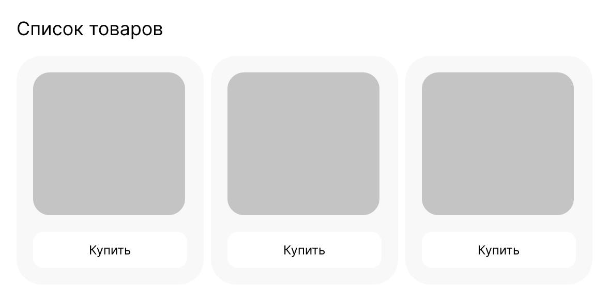

# Задание 2. Список товаров

## Предварительная информация

Вам предстоит выполнить тестовое задание от Школы разработки интерфейсов.

Напомним, что необязательно решать все задачи — вы можете выбрать только те задания, которые ближе вам по уровню и теме. Отдельные задачи можно выполнять постепенно, в любом порядке и в удобное для вас время.

**Тема задачи «Список товаров» – верстка, HTML, CSS; низкий уровень сложности.**

Теперь о том, как всё будет проходить:

- **Задачу нужно выполнить в течение 3 часов с момента нажатия на кнопку «Стартовать виртуальное соревнование»**. Поставить на паузу нельзя.
- Когда задание выполнено полностью, нажмите кнопку «Завершить». Отменить это действие уже не получится.
- Все задания нужно сдать до 23:59 14 сентября по московскому времени.

Значение ошибок можно посмотреть в верхнем меню платформы.

Если есть вопросы, связанные с заданиями и Яндекс Контестом, отправьте их здесь, через раздел «Сообщения». Мы постараемся ответить на них как можно скорее, но не гарантируем, что вы получите ответ до истечения срока, отведенного на выполнение задания.

Вопросы о Школе задавайте на frontendschool@yandex-team.ru.

Желаем удачи!

Команда Школы разработки интерфейсов

## Задание

Менеджер попросил дизайнера собрать кликабельный прототип интерфейса. Дизайнер подготовил карточку со списком товаров и передал ее в разработку. На первом шаге необходимо получить верстку этой карточки.

<p align="center"></p>

Макет со списком товаров [представлен в Figma](https://www.figma.com/file/qIF6XC3hPJytqWpjhz1OhJ/SHRI-%7C-2022?node-id=0%3A1). ([Копия](<https://www.figma.com/file/t2u1ktqcbP09kQ6bEzbAXO/SHRI-%7C-2022-(Copy)>) на случай, если доступ пропадет)

Нужно сверстать карточку со списком товаров. Кусок верстки — а именно то, что находится внутри тега `body` — необходимо положить в константу `htmlFragment`. При тестировании эта строка будет подставлена внутрь тега `body`. Для локального тестирования решения — ссылка ниже.

```js
const htmlFragment = ``;

module.exports = function (): string {
  return htmlFragment;
};
```

### Формат данных

У тега body в тестируемом файле уже стоит `padding: 0` и `margin: 0`.

Решение будет проверяться на Node 12.

### Примечания

Также обращайте внимание на все отступы, высоты и ширины. При полном соответствии макету не должно возникнуть проблем с решением.

Шрифты загружать не нужно.

Тег `style` необходимо положить в константу `htmlFragment`.

Локальный тестер решения с примером: см. [tester_markup.zip](./tester_markup.zip)
