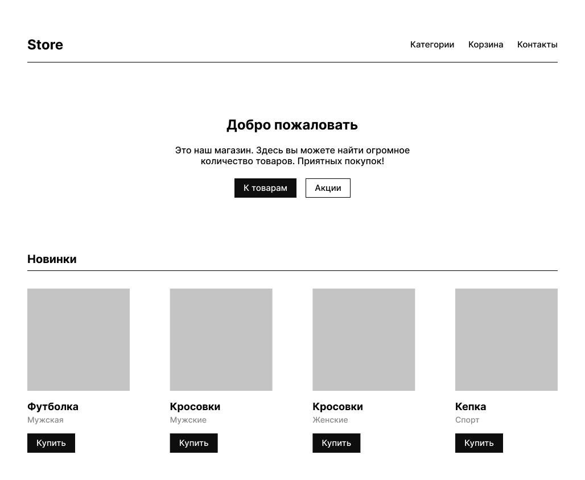

# Задание 3. Figma to HTML

## Предварительная информация

Вам предстоит выполнить тестовое задание от Школы разработки интерфейсов.

Напомним, что необязательно решать все задачи — вы можете выбрать только те задания, которые ближе вам по уровню и теме. Отдельные задачи можно выполнять постепенно, в любом порядке и в удобное для вас время.

**Тема задачи «Figma to HTML» – обход дерева, HTML, разбор документации; средний уровень сложности.**

Теперь о том, как всё будет проходить:

- **Задачу нужно выполнить в течение 3 часов с момента нажатия на кнопку «Стартовать виртуальное соревнование»**. Поставить на паузу нельзя.
- Когда задание выполнено полностью, нажмите кнопку «Завершить». Отменить это действие уже не получится.
- Все задания нужно сдать до 23:59 14 сентября по московскому времени.

Значение ошибок можно посмотреть в верхнем меню платформы.

Если есть вопросы, связанные с заданиями и Яндекс Контестом, отправьте их здесь, через раздел «Сообщения». Мы постараемся ответить на них как можно скорее, но не гарантируем, что вы получите ответ до истечения срока, отведенного на выполнение задания.

Вопросы о Школе задавайте на frontendschool@yandex-team.ru.

Желаем удачи!

Команда Школы разработки интерфейсов

## Задание

В современном мире каждый фронтенд-разработчик так или иначе работает с Figma – инструментом для создания дизайн-систем, макетов интерфейсов и прототипирования сценариев. Дизайнеры любят Figma за лёгкость и простоту.

Хороший специалист выстроит структуру макета так, чтобы разработчику была понятна упорядоченность компонентов. Грамотно составленная структура позволяет сразу приступить к вёрстке. Сам процесс вёрстки давно не является rocket science, но всё ещё требует много времени и усилий. Хотя время разработчика – дорогой ресурс, предлагаем потратить его на создание универсального адаптера из Figma-файла в HTML, чтобы упростить жизнь в будущем.

Макет списка товаров, который ранее уже предстояло сверстать, [представлен в Figma](https://www.figma.com/file/qIF6XC3hPJytqWpjhz1OhJ/SHRI-%7C-2022?node-id=0%3A1) (вот [копия](<https://www.figma.com/file/iUxL7s8gdHKfFFmZyl9JQY/SHRI-(Copy)?node-id=0%3A1>)) и с помощью API выгружен в виде JSON-файла (ссылка «Скачать условие задачи» – ниже).

<p align="center"></p>

Нужно написать функцию, которая преобразует этот файл в HTML, а затем вернет HTML в виде строки. При тестировании эта строка будет подставлена внутрь тега body. Для локального тестирования решения – ссылка ниже.

Описание функции и параметров дано на Typescript, но функцию требуется написать на JS.

```typescript
module.exports = function (json: object): string {};
```

### Формат данных

Описание формата JSON доступно по [ссылке на документацию](https://www.figma.com/plugin-docs/api/nodes/).

Обращаем внимание, что цвета в json заданы от 0 до 1. [Ссылка на документацию](https://www.figma.com/plugin-docs/api/RGB/).

У тега body в тестируемом файле уже стоит `padding: 0` и `margin: 0`.

Решение будет проверяться на Node 12.

### Примечания

Также обращайте внимание на все отступы, высоты и ширины. При полном соответствии макету, не должно возникнуть проблем с решением.

Шрифты загружать не нужно.

Ссылка на локальный тестер решения с примером: [tester_figma.zip](./tester_figma.zip)

Условие задачи: [input.json](./input.json)
