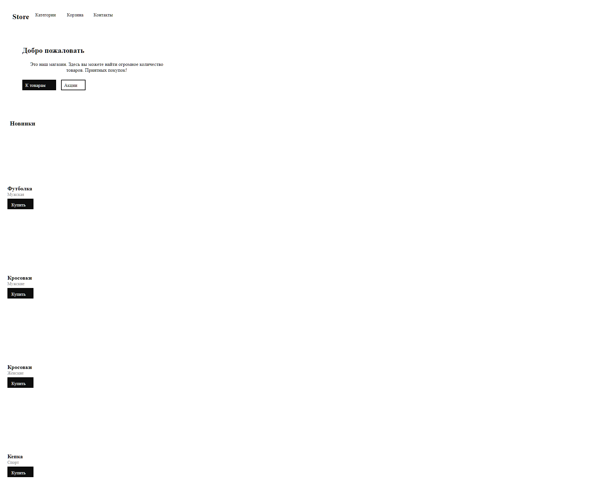
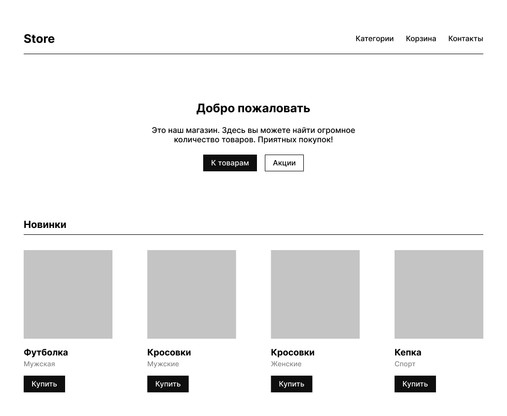

# Задание 3. Figma to HTML

## Краткая сводка

- На задачу потратил все 3 часа
- Завалил все 2 теста
- Получил 0 баллов
- Было непросто, считаю, что задачу, в целом, выполнил, хоть и завалил тесты

Содержимое [solution.js](./solution.js) - мой ответ, который и принёс указанный результат

## Как решал

Когда прочитал задание, ужаснулся. Оно выглядело гигантским и неподъёмным. Не понимал, как подступиться, что и как делать.

Основные претензии к формулировке задания:

- Непонятно, что именно сделать нужно. Только HTML сгенерировать? Или со стилями? Или HTML со стилями да и так, чтобы все выглядело 1 в 1 с макетом?
- Непонятно, что именно проверяют тесты. То ли структуру HTML, то ли только сходство с макетом. Просто проваливаешь тесты и непонятно даже примерно, что им не понравилось.
- Перевести стили из Figma в HTML - это как-то перебор для 3-часового задания. HTML структуру - это ещё ладно, но ещё и стили? Это хорошо, что я довольно хорошо знаю Figma. Но что делать людям, которые плохо знают эту программу? Остается только посочувствовать.
- Стили должны быть инлайновыми или через тег `styles`?
- Ну и по классике (как и в некоторых других заданиях): а какое это имеет отношение к задачам, с которыми сталкивается фронтенд-разработчик? Просто сложное искусственное задание, опыт решения которого ты больше нигде не сможешь применить.

Да, там есть форма, которая позволяет задать вопросы. Но в субботу? В середине дня? А время-то тикает, так что выбирай: задать вопросы и скорее всего не получить ответ, или пытаться решать дальше задание.

Теперь к решению. Перечитал задание раз 10 и минут через 30-40 уже лучше понимал, что нужно. Изучил их код - оказалось, что в целом они уже сделали процентов 70 всего задания.

Оставалось только придумать рекурсивный подход, о чем они прямо и написали в комментариях и установить соответствие между HTML, атрибутами CSS и Figma'вской структурой JSON и их стилями.

Мне лень объяснять, как работает код, поэтому вот несколько кусков, как я рекурсивно обходил JSON:

```js
function traverse(node) {
  // Начало моего кода (объявление функции и её вызов они предоставили сами)

  if (node.children === undefined) return PRIMITIVES[node.type](node);
  let result = "";
  for (let i = 0; i < node.children.length; i++) {
    result += PRIMITIVES[node.children[i].type](node.children[i]);
  }
  return result;

  // Конец моего кода
}
```

Вы спросите, где же рекурсия? Она в `PRIMITIVES`

- `TEXT`, `RECTANGLE` - там не нужна рекурсия, у этих элементов нет детей
- `FRAME`, `INSTANCE` - у них есть дети, как правило. Поэтому у них `content: traverse(node)` - вот и рекурсия

По-хорошему, `INSTANCE` надо было пропускать и не добавлять для них свой узел в HTML DOM... Но и так сойдёт

```js
const PRIMITIVES = {
  // Изначально тут был только TEXT описан, FRAME, INSTANCE, RECTANGLE добавил я

  TEXT: (node) => {
    return buildBlock({
      type: "span",
      content: node.characters,
      className: node.type,
      style: getTextStyles(node),
    });
  },
  FRAME: (node) => {
    return buildBlock({
      type: "div",
      content: traverse(node),
      className: node.type,
      style: getTextStyles(node),
    });
  },
  INSTANCE: (node) => {
    return buildBlock({
      type: node.name === "Button" ? "button" : "div",
      content: traverse(node),
      className: node.type,
      style: getTextStyles(node),
    });
  },
  RECTANGLE: (node) => {
    return buildBlock({
      type: "div",
      content: "",
      className: node.type,
      style: getTextStyles(node),
    });
  },
};
```

Дальше начинался полный треш со стилями. Если кратко, хрен ты смапишь "стили" Figma на стили в итоговом HTML документе

Вот мой итоговый HTML, который сгенерировал скрипт: (я подправил с помощью Prettier отступы)

<details>
  <summary>output.html</summary>

```html
<!DOCTYPE html>
<html lang="en">
  <head>
    <meta charset="UTF-8" />
  </head>
  <body style="padding: 0; margin: 0">
    <div
      class="FRAME"
      style="
        height: 797px;
        width: 980px;
        background: rgba(0, 0, 0, 0);
        display: inherit;
        gap: 48px;
        flex-direction: column;
        gap: 48px;
        padding-left: 24px;
        padding-right: 24px;
        padding-top: 24px;
        padding-left: 24px;
      "
    >
      <div
        class="FRAME"
        style="
          height: 61px;
          width: 932px;
          background: rgba(255, 255, 255, 1);
          display: flex;
          gap: 10px;
          flex-direction: row;
          gap: 10px;
          padding-top: 16px;
          padding-left: 16px;
          color: rgba(255, 255, 255, 1);
        "
      >
        <span
          class="TEXT"
          style="
            font-family: 'Inter';
            font-weight: 700;
            font-size: 24px;
            text-align: left;
            vertical-align: top;
            line-height: 28.125px;
            height: 29px;
            width: 64px;
            display: inherit;
            color: rgba(0, 0, 0, 1);
          "
          >Store</span
        >
        <div
          class="FRAME"
          style="
            height: 18px;
            width: 259px;
            background: rgba(0, 0, 0, 0);
            display: inherit;
            gap: 24px;
            flex-direction: row;
            gap: 24px;
          "
        >
          <span
            class="TEXT"
            style="
              font-family: 'Inter';
              font-weight: 500;
              font-size: 15px;
              text-align: left;
              vertical-align: top;
              line-height: 17.578125px;
              height: 18px;
              width: 78px;
              display: inherit;
              color: rgba(0, 0, 0, 1);
            "
            >Категории</span
          ><span
            class="TEXT"
            style="
              font-family: 'Inter';
              font-weight: 500;
              font-size: 15px;
              text-align: left;
              vertical-align: top;
              line-height: 17.578125px;
              height: 18px;
              width: 62px;
              display: inherit;
              color: rgba(0, 0, 0, 1);
            "
            >Корзина</span
          ><span
            class="TEXT"
            style="
              font-family: 'Inter';
              font-weight: 500;
              font-size: 15px;
              text-align: left;
              vertical-align: top;
              line-height: 17.578125px;
              height: 18px;
              width: 71px;
              display: inherit;
              color: rgba(0, 0, 0, 1);
            "
            >Контакты</span
          >
        </div>
      </div>
      <div
        class="FRAME"
        style="
          height: 239px;
          width: 932px;
          background: rgba(0, 0, 0, 0);
          display: flex;
          gap: 21px;
          flex-direction: column;
          gap: 21px;
          padding-top: 48px;
          padding-left: 48px;
        "
      >
        <span
          class="TEXT"
          style="
            font-family: 'Inter';
            font-weight: 700;
            font-size: 24px;
            text-align: left;
            vertical-align: top;
            line-height: 28.125px;
            height: 29px;
            width: 232px;
            display: inherit;
            color: rgba(0, 0, 0, 1);
          "
          >Добро пожаловать</span
        ><span
          class="TEXT"
          style="
            font-family: 'Inter';
            font-weight: 500;
            font-size: 16px;
            text-align: center;
            vertical-align: top;
            line-height: 18.75px;
            height: 38px;
            width: 480px;
            display: inherit;
            color: rgba(0, 0, 0, 1);
          "
          >Это наш магазин. Здесь вы можете найти огромное количество товаров.
          Приятных покупок!</span
        >
        <div
          class="FRAME"
          style="
            height: 34px;
            width: 204px;
            background: rgba(0, 0, 0, 0);
            display: inherit;
            gap: 16px;
            flex-direction: row;
            gap: 16px;
          "
        >
          <button
            class="INSTANCE"
            style="
              height: 34px;
              width: 109px;
              background: rgba(14, 14, 14, 1);
              display: inherit;
              gap: 10px;
              flex-direction: row;
              gap: 10px;
              padding-left: 16px;
              padding-right: 16px;
              padding-top: 8px;
              padding-left: 8px;
              color: rgba(14, 14, 14, 1);
            "
          >
            <span
              class="TEXT"
              style="
                font-family: 'Inter';
                font-weight: 500;
                font-size: 15px;
                text-align: center;
                vertical-align: top;
                line-height: 17.578125px;
                height: 18px;
                width: 77px;
                display: inherit;
                color: rgba(255, 255, 255, 1);
              "
              >К товарам</span
            ></button
          ><button
            class="INSTANCE"
            style="
              height: 34px;
              width: 79px;
              background: rgba(0, 0, 0, 0);
              display: inherit;
              gap: 10px;
              flex-direction: row;
              gap: 10px;
              padding-left: 16px;
              padding-right: 16px;
              padding-top: 8px;
              padding-left: 8px;
            "
          >
            <span
              class="TEXT"
              style="
                font-family: 'Inter';
                font-weight: 500;
                font-size: 15px;
                text-align: center;
                vertical-align: top;
                line-height: 17.578125px;
                height: 18px;
                width: 47px;
                display: inherit;
                color: rgba(0, 0, 0, 1);
              "
              >Акции</span
            >
          </button>
        </div>
      </div>
      <div
        class="FRAME"
        style="
          height: 353px;
          width: 932px;
          background: rgba(0, 0, 0, 0);
          display: inherit;
          gap: 32px;
          flex-direction: column;
          gap: 32px;
        "
      >
        <div
          class="FRAME"
          style="
            height: 32px;
            width: 932px;
            background: rgba(255, 255, 255, 1);
            display: flex;
            flex-direction: column;
            padding-left: 8px;
            color: rgba(255, 255, 255, 1);
          "
        >
          <span
            class="TEXT"
            style="
              font-family: 'Inter';
              font-weight: 700;
              font-size: 20px;
              text-align: left;
              vertical-align: top;
              line-height: 23.4375px;
              height: 24px;
              width: 87px;
              display: inherit;
              color: rgba(0, 0, 0, 1);
            "
            >Новинки</span
          >
        </div>
        <div
          class="FRAME"
          style="
            height: 289px;
            width: 932px;
            background: rgba(0, 0, 0, 0);
            display: inherit;
            gap: 48px;
            flex-direction: row;
            gap: 48px;
          "
        >
          <div
            class="INSTANCE"
            style="
              height: 289px;
              width: 180px;
              background: rgba(0, 0, 0, 0);
              display: inherit;
              gap: 16px;
              flex-direction: column;
              gap: 16px;
              color: rgba(255, 255, 255, 1);
            "
          >
            <div
              class="RECTANGLE"
              style="
                height: 180px;
                width: 180px;
                display: inherit;
                color: rgba(196, 196, 196, 1);
              "
            ></div>
            <div
              class="FRAME"
              style="
                height: 43px;
                width: 180px;
                background: rgba(0, 0, 0, 0);
                display: inherit;
                gap: 4px;
                flex-direction: column;
                gap: 4px;
              "
            >
              <span
                class="TEXT"
                style="
                  font-family: 'Inter';
                  font-weight: 700;
                  font-size: 18px;
                  text-align: left;
                  vertical-align: top;
                  line-height: 21.09375px;
                  height: 22px;
                  width: 180px;
                  display: inherit;
                  color: rgba(0, 0, 0, 1);
                "
                >Футболка</span
              ><span
                class="TEXT"
                style="
                  font-family: 'Inter';
                  font-weight: 500;
                  font-size: 14px;
                  text-align: left;
                  vertical-align: top;
                  line-height: 16.40625px;
                  height: 17px;
                  width: 180px;
                  display: inherit;
                  color: rgba(135, 135, 135, 1);
                "
                >Мужская</span
              >
            </div>
            <button
              class="INSTANCE"
              style="
                height: 34px;
                width: 84px;
                background: rgba(14, 14, 14, 1);
                display: inherit;
                gap: 10px;
                flex-direction: row;
                gap: 10px;
                padding-left: 16px;
                padding-right: 16px;
                padding-top: 8px;
                padding-left: 8px;
                color: rgba(14, 14, 14, 1);
              "
            >
              <span
                class="TEXT"
                style="
                  font-family: 'Inter';
                  font-weight: 500;
                  font-size: 15px;
                  text-align: center;
                  vertical-align: top;
                  line-height: 17.578125px;
                  height: 18px;
                  width: 52px;
                  display: inherit;
                  color: rgba(255, 255, 255, 1);
                "
                >Купить</span
              >
            </button>
          </div>
          <div
            class="INSTANCE"
            style="
              height: 289px;
              width: 180px;
              background: rgba(0, 0, 0, 0);
              display: inherit;
              gap: 16px;
              flex-direction: column;
              gap: 16px;
              color: rgba(255, 255, 255, 1);
            "
          >
            <div
              class="RECTANGLE"
              style="
                height: 180px;
                width: 180px;
                display: inherit;
                color: rgba(196, 196, 196, 1);
              "
            ></div>
            <div
              class="FRAME"
              style="
                height: 43px;
                width: 180px;
                background: rgba(0, 0, 0, 0);
                display: inherit;
                gap: 4px;
                flex-direction: column;
                gap: 4px;
              "
            >
              <span
                class="TEXT"
                style="
                  font-family: 'Inter';
                  font-weight: 700;
                  font-size: 18px;
                  text-align: left;
                  vertical-align: top;
                  line-height: 21.09375px;
                  height: 22px;
                  width: 180px;
                  display: inherit;
                  color: rgba(0, 0, 0, 1);
                "
                >Кросовки</span
              ><span
                class="TEXT"
                style="
                  font-family: 'Inter';
                  font-weight: 500;
                  font-size: 14px;
                  text-align: left;
                  vertical-align: top;
                  line-height: 16.40625px;
                  height: 17px;
                  width: 180px;
                  display: inherit;
                  color: rgba(135, 135, 135, 1);
                "
                >Мужские</span
              >
            </div>
            <button
              class="INSTANCE"
              style="
                height: 34px;
                width: 84px;
                background: rgba(14, 14, 14, 1);
                display: inherit;
                gap: 10px;
                flex-direction: row;
                gap: 10px;
                padding-left: 16px;
                padding-right: 16px;
                padding-top: 8px;
                padding-left: 8px;
                color: rgba(14, 14, 14, 1);
              "
            >
              <span
                class="TEXT"
                style="
                  font-family: 'Inter';
                  font-weight: 500;
                  font-size: 15px;
                  text-align: center;
                  vertical-align: top;
                  line-height: 17.578125px;
                  height: 18px;
                  width: 52px;
                  display: inherit;
                  color: rgba(255, 255, 255, 1);
                "
                >Купить</span
              >
            </button>
          </div>
          <div
            class="INSTANCE"
            style="
              height: 289px;
              width: 180px;
              background: rgba(0, 0, 0, 0);
              display: inherit;
              gap: 16px;
              flex-direction: column;
              gap: 16px;
              color: rgba(255, 255, 255, 1);
            "
          >
            <div
              class="RECTANGLE"
              style="
                height: 180px;
                width: 180px;
                display: inherit;
                color: rgba(196, 196, 196, 1);
              "
            ></div>
            <div
              class="FRAME"
              style="
                height: 43px;
                width: 180px;
                background: rgba(0, 0, 0, 0);
                display: inherit;
                gap: 4px;
                flex-direction: column;
                gap: 4px;
              "
            >
              <span
                class="TEXT"
                style="
                  font-family: 'Inter';
                  font-weight: 700;
                  font-size: 18px;
                  text-align: left;
                  vertical-align: top;
                  line-height: 21.09375px;
                  height: 22px;
                  width: 180px;
                  display: inherit;
                  color: rgba(0, 0, 0, 1);
                "
                >Кросовки</span
              ><span
                class="TEXT"
                style="
                  font-family: 'Inter';
                  font-weight: 500;
                  font-size: 14px;
                  text-align: left;
                  vertical-align: top;
                  line-height: 16.40625px;
                  height: 17px;
                  width: 180px;
                  display: inherit;
                  color: rgba(135, 135, 135, 1);
                "
                >Женские</span
              >
            </div>
            <button
              class="INSTANCE"
              style="
                height: 34px;
                width: 84px;
                background: rgba(14, 14, 14, 1);
                display: inherit;
                gap: 10px;
                flex-direction: row;
                gap: 10px;
                padding-left: 16px;
                padding-right: 16px;
                padding-top: 8px;
                padding-left: 8px;
                color: rgba(14, 14, 14, 1);
              "
            >
              <span
                class="TEXT"
                style="
                  font-family: 'Inter';
                  font-weight: 500;
                  font-size: 15px;
                  text-align: center;
                  vertical-align: top;
                  line-height: 17.578125px;
                  height: 18px;
                  width: 52px;
                  display: inherit;
                  color: rgba(255, 255, 255, 1);
                "
                >Купить</span
              >
            </button>
          </div>
          <div
            class="INSTANCE"
            style="
              height: 289px;
              width: 180px;
              background: rgba(0, 0, 0, 0);
              display: inherit;
              gap: 16px;
              flex-direction: column;
              gap: 16px;
              color: rgba(255, 255, 255, 1);
            "
          >
            <div
              class="RECTANGLE"
              style="
                height: 180px;
                width: 180px;
                display: inherit;
                color: rgba(196, 196, 196, 1);
              "
            ></div>
            <div
              class="FRAME"
              style="
                height: 43px;
                width: 180px;
                background: rgba(0, 0, 0, 0);
                display: inherit;
                gap: 4px;
                flex-direction: column;
                gap: 4px;
              "
            >
              <span
                class="TEXT"
                style="
                  font-family: 'Inter';
                  font-weight: 700;
                  font-size: 18px;
                  text-align: left;
                  vertical-align: top;
                  line-height: 21.09375px;
                  height: 22px;
                  width: 180px;
                  display: inherit;
                  color: rgba(0, 0, 0, 1);
                "
                >Кепка</span
              ><span
                class="TEXT"
                style="
                  font-family: 'Inter';
                  font-weight: 500;
                  font-size: 14px;
                  text-align: left;
                  vertical-align: top;
                  line-height: 16.40625px;
                  height: 17px;
                  width: 180px;
                  display: inherit;
                  color: rgba(135, 135, 135, 1);
                "
                >Спорт</span
              >
            </div>
            <button
              class="INSTANCE"
              style="
                height: 34px;
                width: 84px;
                background: rgba(14, 14, 14, 1);
                display: inherit;
                gap: 10px;
                flex-direction: row;
                gap: 10px;
                padding-left: 16px;
                padding-right: 16px;
                padding-top: 8px;
                padding-left: 8px;
                color: rgba(14, 14, 14, 1);
              "
            >
              <span
                class="TEXT"
                style="
                  font-family: 'Inter';
                  font-weight: 500;
                  font-size: 15px;
                  text-align: center;
                  vertical-align: top;
                  line-height: 17.578125px;
                  height: 18px;
                  width: 52px;
                  display: inherit;
                  color: rgba(255, 255, 255, 1);
                "
                >Купить</span
              >
            </button>
          </div>
        </div>
      </div>
    </div>
  </body>
</html>
```

</details>

Вот результат:



А должно было быть так:



Это надо было сделать, имея только JSON из API Figma!

## Решение перед выкладкой

Такое же, как и само решение

```js
const TEXT_STYLES_MAPPER = {
  fontSize: (value) => `font-size: ${value}px;`,
  fontWeight: (value) => `font-weight: ${value};`,
  fontFamily: (value) => `font-family: '${value}';`,
  lineHeightPx: (value) => `line-height: ${value}px;`,
  textAlignHorizontal: (value) => `text-align: ${value.toLowerCase()};`,
  textAlignVertical: (value) => `vertical-align: ${value.toLowerCase()};`,
};

const buildBlock = ({ type, content, className, style }) => {
  return `<${type} class="${className}" style="${style}">${content}</${type}>`;
};

const getTextStyles = (node) => {
  const styleArr = [];
  if (node.style) {
    for (let [key, value] of Object.entries(node.style)) {
      if (TEXT_STYLES_MAPPER[key]) {
        styleArr.push(TEXT_STYLES_MAPPER[key](value));
      }
    }
  }
  if (node.absoluteBoundingBox) {
    styleArr.push(`height: ${node.absoluteBoundingBox.height}px;`);
    styleArr.push(`width: ${node.absoluteBoundingBox.width}px;`);
  }
  if (node.backgroundColor) {
    let object = node.backgroundColor;
    styleArr.push(
      `background: rgba(${Math.round(object.r * 255)}, ${Math.round(
        object.g * 255
      )}, ${Math.round(object.b * 255)}, ${object.a});`
    );
  }
  if (node.layoutAlign) {
    styleArr.push(
      `display: ${node.layoutAlign === "INHERIT" ? "inherit" : "flex"};`
    );
  }
  if (node.itemSpacing) {
    styleArr.push(`gap: ${node.itemSpacing}px;`);
  }
  if (node.layoutMode) {
    styleArr.push(
      `flex-direction: ${node.layoutMode === "VERTICAL" ? "column" : "row"};`
    );
  }
  if (node.layoutMode) {
    styleArr.push(
      `flex-direction: ${node.layoutMode === "VERTICAL" ? "column" : "row"};`
    );
  }
  if (node.itemSpacing) {
    styleArr.push(`gap: ${node.itemSpacing}px;`);
  }

  if (node.paddingLeft) styleArr.push(`padding-left: ${node.paddingLeft}px;`);
  if (node.paddingRight)
    styleArr.push(`padding-right: ${node.paddingRight}px;`);
  if (node.paddingTop) styleArr.push(`padding-top: ${node.paddingTop}px;`);
  if (node.paddingBottom)
    styleArr.push(`padding-left: ${node.paddingBottom}px;`);

  if (node.fills && node.fills[0]) {
    let object = node.fills[0].color;
    styleArr.push(
      `color: rgba(${Math.round(object.r * 255)}, ${Math.round(
        object.g * 255
      )}, ${Math.round(object.b * 255)}, ${object.a});`
    );
  }
  return styleArr.join(" ");
};

const PRIMITIVES = {
  TEXT: (node) => {
    return buildBlock({
      type: "span",
      content: node.characters,
      className: node.type,
      style: getTextStyles(node),
    });
  },
  FRAME: (node) => {
    return buildBlock({
      type: "div",
      content: traverse(node),
      className: node.type,
      style: getTextStyles(node),
    });
  },
  INSTANCE: (node) => {
    return buildBlock({
      type: node.name === "Button" ? "button" : "div",
      content: traverse(node),
      className: node.type,
      style: getTextStyles(node),
    });
  },
  RECTANGLE: (node) => {
    return buildBlock({
      type: "div",
      content: "",
      className: node.type,
      style: getTextStyles(node),
    });
  },
};

const parse = (entry) => {
  return traverse(entry.children[0]);
};

function traverse(node) {
  if (node.children === undefined) return PRIMITIVES[node.type](node);
  let result = "";
  for (let i = 0; i < node.children.length; i++) {
    result += PRIMITIVES[node.children[i].type](node.children[i]);
  }
  return result;
}

module.exports = function (json) {
  const entry = json.document.children[0];
  return parse(entry);
};
```
