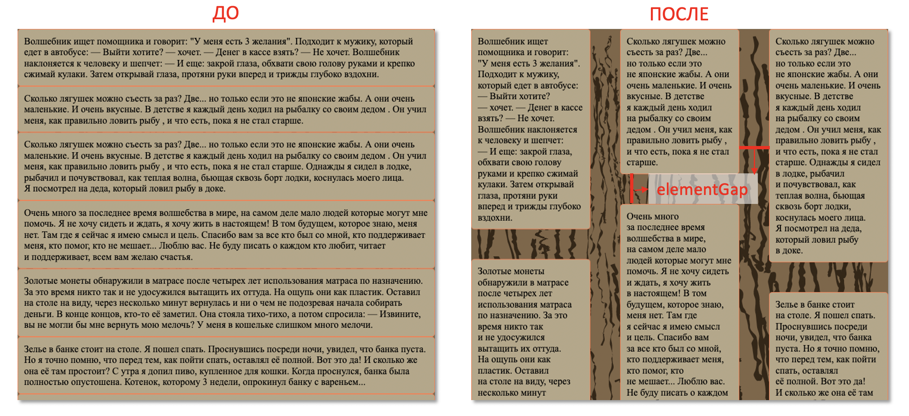

# Задание 5. Объявление

## Предварительная информация

Вам предстоит выполнить тестовое задание от Школы разработки интерфейсов.

Напомним, что необязательно решать все задачи — вы можете выбрать только те задания, которые ближе вам по уровню и теме. Отдельные задачи можно выполнять постепенно, в любом порядке и в удобное для вас время.

**Тема задачи «Объявление» – CSS, JS, DOM, расчет сетки; средний уровень сложности.**

Теперь о том, как всё будет проходить:

- **Задачу нужно выполнить в течение 3 часов с момента нажатия на кнопку «Стартовать виртуальное соревнование»**. Поставить на паузу нельзя.
- Когда задание выполнено полностью, нажмите кнопку «Завершить». Отменить это действие уже не получится.
- Все задания нужно сдать до 23:59 14 сентября по московскому времени.

Значение ошибок можно посмотреть в верхнем меню платформы.

Если есть вопросы, связанные с заданиями и Яндекс Контестом, отправьте их здесь, через раздел «Сообщения». Мы постараемся ответить на них как можно скорее, но не гарантируем, что вы получите ответ до истечения срока, отведенного на выполнение задания.

Вопросы о Школе задавайте на frontendschool@yandex-team.ru.

Желаем удачи!

Команда Школы разработки интерфейсов

## Задание

Задача написать JavaScript-функцию, которая разместит блоки с текстом как газетные колонки.

### Формат ввода

Реализуйте функцию renderWaterfall. На вход она должна принимать следующие параметры:

- `rootNode`: элемент в котором находятся объявления (`HTMLDivElement`)
- `columnCount`: количество колонок (`number`)
- `elementGap`: расстояние между колонками, а также элементами по-вертикали (`number`)

Пример `rootNode`:

```html
<div class="root">
  <div class="el">У каждого объявления есть свои стили</div>
  <div class="el">Их не нужно менять</div>
  <div class="el">Каждое объявление должно быть свободным по высоте</div>
  <div class="el">А вот ширину колонок нужно будет выставить</div>
  <div class="el">
    Ширину элемента root, при необходимости вы можете определить, но в тестах
    она может быть разная
  </div>
</div>
```

### Формат вывода

При вызове в контексте html-страницы функция `renderWaterfall` должна расположить DOM-элементы объявлений так, чтобы они разместились в `columnsCount` колонок, а расстояние между ними составляло `elementGap`. Каждый следующий элемент нужно помещать в ту колонку, высота которой меньше остальных. При равных наименьших высотах элемент помещается в первую колонку слева.

Например:

```js
function renderWaterfall(rootNode, columnCount, elementGap) {
  // ...
}
```

### Примечания

Не удаляйте существующие классы элементов. Вы можете изменять ширину объявлений, но высота должна быть зависимой от контента. Можно добавлять свои дополнительные элементы для структурирования.

Для расположения корневого элемента рекомендуется использовать `display:flex`.

Посмотрите пример ожидаемого расположения элементов.

<p align="center"></p>
