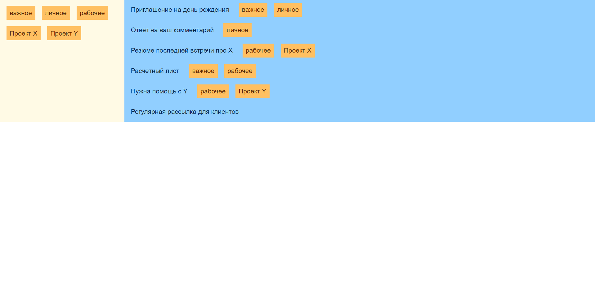

# Задание 6. Drag and Drop

## Предварительная информация

Вам предстоит выполнить тестовое задание от Школы разработки интерфейсов.

Напомним, что необязательно решать все задачи — вы можете выбрать только те задания, которые ближе вам по уровню и теме. Отдельные задачи можно выполнять постепенно, в любом порядке и в удобное для вас время.

**Тема задачи «Drag and Drop» – «оживление» HTML и CSS с помощью JS, работа с DOM-событиями; средний уровень сложности.**

Теперь о том, как всё будет проходить:

- **Задачу нужно выполнить в течение 3 часов с момента нажатия на кнопку «Стартовать виртуальное соревнование»**. Поставить на паузу нельзя.
- Когда задание выполнено полностью, нажмите кнопку «Завершить». Отменить это действие уже не получится.
- Все задания нужно сдать до 23:59 14 сентября по московскому времени.

Значение ошибок можно посмотреть в верхнем меню платформы.

Если есть вопросы, связанные с заданиями и Яндекс Контестом, отправьте их здесь, через раздел «Сообщения». Мы постараемся ответить на них как можно скорее, но не гарантируем, что вы получите ответ до истечения срока, отведенного на выполнение задания.

Вопросы о Школе задавайте на frontendschool@yandex-team.ru.

Желаем удачи!

Команда Школы разработки интерфейсов

## Задание

Перетаскивание элементов интерфейса часто используется в операционных системах и реже – в веб-интерфейсах, хотя все необходимые API уже есть в современных браузерах. Эта задача может стать поводом вспомнить или изучить всё, что нужно, чтобы добавить такие возможности в своём проекте.

Представьте, что есть упрощённый интерфейс работы с электронной почтой. Нужно реализовать возможность расставлять теги на письма, используя [drag and drop API](https://developer.mozilla.org/en-US/docs/Web/API/HTML_Drag_and_Drop_API).

Есть две основные зоны: зона с тегами и зона с письмами. Теги можно перетаскивать из зоны всех тегов на письма и между письмами, а также снимать с писем, перетаскивая обратно в зону тегов.

Если начать перетаскивать тег то:

- Тегу должен быть присвоен класс `Tag_dragged` — это позволит перетаскиваемому тегу иметь специальное отображение.
- Зоне писем должен быть присвоен класс `Letters_dropzone` — это позволит подсветить возможное назначение для перетаскивания.
- Если тег перетаскивается с письма, то дополнительно зоне тегов должен быть присвоен класс `Tags_dropzone` — это позволит подсветить ещё одно возможное назначение для перетаскивания.

Если тег перетаскивается с письма, то дополнительно зоне тегов должен быть присвоен класс `Tags_dropzone` — это позволит подсветить ещё одно возможное назначение для перетаскивания. При перетаскивании тега на письмо, на котором данный тег отсутствует, письму присваивается класс `Letter_dragovered` — это позволяет подсвечивать только те письма, на которые можно бросить данный тег.

При перетаскивании тега с письма на зону тегов, зоне тегов должен быть присвоен класс `Tags_dragovered` — это позволит подсветить возможность бросить тег.

При броске тега на письмо, на котором данный тег отсутствует, он должен быть на него проставлен. При этом новый тег должен оказаться после всех существующих. Если тег перетаскивался с другого письма, то он должен исчезнуть с исходного.

При перетаскивании тега с письма на зону тегов, он должен сниматься с письма.

Все нужные стили и разметку можно найти в заготовке в архиве `drag-n-drop-stub.zip`. В качестве решения нужно отправить файл `index.html` из данного архива.

### Примечания

Решение должно представлять из себя один HTML-файл (все нужные скрипты и стили должны быть включены внутрь).

Автоматические тесты будут запущены на вызов функции `window.onSolutionReady()`, которая декларируется автоматически в тестовом окружении (не нужно её переопределять) и уже вызывается в шаблоне (без необходимости не нужно менять эту часть кода). Если вызов функции не произойдёт в течение 2 минут, то задание считается невыполненным. Структура HTML из шаблона решения должна быть сохранена.

Ваше решение будет тестироваться в последней версии браузера Google Chrome.

Скачать условие задачи: [drag-n-drop-stub.zip](drag-n-drop-stub.zip)
