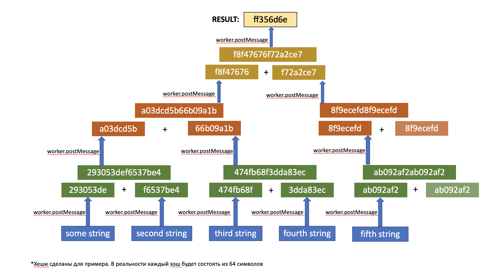

# Задание 7. Многопоточные вычисления

## Предварительная информация

Вам предстоит выполнить тестовое задание от Школы разработки интерфейсов.

Напомним, что необязательно решать все задачи — вы можете выбрать только те задания, которые ближе вам по уровню и теме. Отдельные задачи можно выполнять постепенно, в любом порядке и в удобное для вас время.

**Тема задачи «Многопоточные вычисления» – promise, структуры данных; высокий уровень сложности.**

Теперь о том, как всё будет проходить:

- **Задачу нужно выполнить в течение 3 часов с момента нажатия на кнопку «Стартовать виртуальное соревнование».** Поставить на паузу нельзя.
- Когда задание выполнено полностью, нажмите кнопку «Завершить». Отменить это действие уже не получится.
- Все задания нужно сдать до 23:59 14 сентября по московскому времени.

Значение ошибок можно посмотреть в верхнем меню платформы.

Если есть вопросы, связанные с заданиями и Яндекс Контестом, отправьте их здесь, через раздел «Сообщения». Мы постараемся ответить на них как можно скорее, но не гарантируем, что вы получите ответ до истечения срока, отведенного на выполнение задания.

Вопросы о Школе задавайте на frontendschool@yandex-team.ru.

Желаем удачи!

Команда Школы разработки интерфейсов

## Задание

<table>
  <tr>
    <th>Ограничение времени</th>
    <td>20 секунд</td>
  </tr>
  <tr>
    <th>Ограничение памяти</th>
    <td>20 секунд</td>
  </tr>
  <tr>
    <th>Ввод</th>
    <td>стандартный ввод или <code>input.json</code></td>
  </tr>
  <tr>
    <th>Вывод</th>
    <td>стандартный вывод или <code>output.txt</code></td>
  </tr>
</table>

Ваша команда занимается разработкой сервиса быстрого поиска книг по нескольким ключевым предложениям. Алгоритм такого поиска подразумевает вычисление хеша из входных данных по определённому алгоритму, описанному ниже.

Вам поставили задачу адаптировать получение хеша под многопоточные вычисления, причём нужно учитывать, что количество потоков ограничено и не известно. Члены команды уже написали подпрограмму `Worker`, которая умеет высчитывать хеш, однако она является однопоточной, и из-за особенностей реализации после вычисления хеша инстанс подпрограммы нужно удалить.

Вот интерфейс программы Worker:

```js
interface Worker {
  /**
   * Для создания инстанса нужно передать путь до исполняемого кода,
   * в нашем случае это всегда "./worker".
   *
   * Не забудьте добавить обработчик исключения, так как если достигнут лимит потоков,
   * нужно дождаться, пока можно будет создавать новые.
   */
  new (path: string);

  /**
   * Сюда нужно записать свою функцию-обработчик, чтобы принимать сообщения от программы.
   */
  onMessage?: (message: {data: string}) => void;

  /**
   * Эту функцию нужно вызвать для передачи данных нашей подпрограмме, который её захеширует.
   */
  postMessage: (text: string) => void;

  /**
   * После одного использования, нужно удалить инстанс подпрограммы,
   * таким образом освобождать потоки для следующих программ.
   */
  delete: () => void;
}
```

Итак, для начала вам нужно организовать некую **очередь** по работе с подпрограммами. Работа с одной подпрограммой может выглядеть вот так:

```js
const Worker = require("./WorkerClass");

const doOneWork = (text: string) => {
  try {
    const worker = new Worker("./worker"); // создаём подпрограмму, которая займёт один из потоков

    worker.onMessage = ({ data }) => {
      // подписываемся на его сообщение
      // тут работа выполнена, используем data и освобождаем процесс
      worker.delete();
    };

    worker.postMessage(text); // отправляем сообщение подпрограмме, чтобы он начал работу
  } catch (e) {
    // свободных потоков нет, ждём освобождения и создаём инстанс подпрограммы повторно
  }
};
```

### Алгоритм построения хеша

Необходимо преобразовать результаты работы подпрограмм к одному хешу.

- На вход вашей функции передаётся массив строк, где записаны данные.
- Нужно с помощью подпрограмм (Worker) каждую строку преобразовать в хеш, а затем результаты попарно конкатенировать в порядке расположения в массиве.
- Если количество элементов нечётное, последний конкатенируем со своей копией.
- Над новыми строками повторяем предыдущий шаг, пока не останется один хеш (**от последней строки, тоже следует вычислить хеш**).
- Если во входных данных есть пустой массив, то нужно вернуть «0» (строкой).

Наглядную схему алгоритма можно скачать по ссылке ниже условия задачи.

Для реализации алгоритма вам может пригодится очередь.

### Формат ввода

На вход подаётся массив строк с данными, которые могут быть произвольными.

```js
[
  "easy to get started",
  "70 real-world techniques",
  "Go may be the perfect systems language.",
  "testing and debugging",
  "sophisticated cloud-native",
  "Principal Engineer",
  "open source contributors",
];
```

### Формат вывода

Ваша функция должна возвращать Promise, который резолвит результат строкой, например:
`"a29de6e1bb95780cf38d9124b26e7011ebf6809e091eb6c98abc1961e40ea8c6"`

### Примечания

В форматах ввода и вывода приведены реальные данные первого теста.
Файл с решением требуется оформить по шаблону:

```js
const Worker = require("./WorkerClass");

module.exports = (input) => new Promise((resolve) => { ... resolve(result) ... }
```

Нельзя использовать в решениях минифицированный код. Организаторы оставляют за собой право принимать решение о результатах соревнования на основе экспертной оценки исходного кода участников.

Наглядная схема вычисления хэша:

<p align="center"></p>
