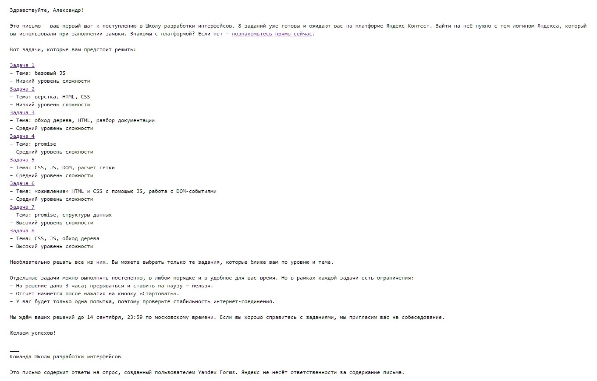

# Школа Разработки Интерфейсов. Осень 2022. Контест

## Задачи

<table>
  <tr>
    <th>№</th>
    <th>Название</th>
    <th>Сложность</th>
    <th>Краткое описание</th>
    <th>Пройдено&nbsp;тестов&nbsp;/ Набрано баллов</th>
  </tr>
  
  <tr>
    <td>1</td>
    <td>Фоторамки</td>
    <td align="center"></td>
    <td>
      <strong>Темы</strong>: Базовый JavaScript
        
      <strong>На вход:</strong>
       Число фоторамок
       Ширина области для фоторамок
       Высота области для фоторамок
        
      <strong>На выход:</strong>
       Функция: возвращает массив объектов с шириной, высотой, x, y каждой рамки
    </td>
    <td align="center"><code>17 / 20</code> ∙ <code>17</code></td>
  </tr>
  
  <tr>
    <td>2</td>
    <td>Список&nbsp;товаров</td>
    <td align="center"></td>
    <td>
      <strong>Темы</strong>: Верстка, HTML, CSS
        
      Задача сверстать карточку с товарами максимально близко к макету из Figma
    </td>
    <td align="center"><code>1 / 1</code> ∙ <code>10</code></td>
  </tr>
  
  <tr>
    <td>3</td>
    <td>Figma&nbsp;to&nbsp;HTML</td>
    <td align="center"></td>
    <td>
      <strong>Темы</strong>: Обход дерева, HTML, разбор документации
        
      <strong>На вход:</strong>
       JSON-файл макета Figma (выгружен из их API)
        
      <strong>На выход:</strong>
       Функция: преобразует этот JSON в HTML (стили тоже нужно перенести)
        
      <em>(решил, но не прошло тесты)</em>
    </td>
    <td align="center"><code>0 / 3</code> ∙ <code>0</code></td>
  </tr>
  
  <tr>
    <td>4</td>
    <td>Лабиринт</td>
    <td align="center"></td>
    <td>
      <strong>Темы</strong>: Promise
        
      <strong>На вход:</strong>
       Начальная точка в лабиринте
       Объект для взаимодействия с лабиринтом
        
      <strong>На выход:</strong>
       Функция: возвращает точку x,y выхода из лабиринта
        
      <em>(не решал)</em>
    </td>
    <td align="center"><code>0 / 8</code> ∙ <code>0</code></td>
  </tr>
  
  <tr>
    <td>5</td>
    <td>Объявление</td>
    <td align="center"></td>
    <td>
      <strong>Темы</strong>: CSS, JS, DOM, расчет сетки
        
      <strong>На вход:</strong>
       Элемент в котором находятся объявления
       Расстояние между колонками, а также элементами по-вертикали
        
      <strong>На выход:</strong>
       Функция: располагает DOM-элементы объявлений так, чтобы они раместились в указанном числе колонок с указанным расстоянием между ними
        
      <em>(решил, но не прошло тесты)</em>
    </td>
    <td align="center"><code>0 / 8</code> ∙ <code>0</code></td>
  </tr>
  
  <tr>
    <td>6</td>
    <td>Drag&nbsp;and&nbsp;Drop</td>
    <td align="center"></td>
    <td>
      <strong>Темы</strong>: «Оживление» HTML и CSS с помощью JS, работа с DOM-событиями
        
      Задача реализовать возможность добавлять, удалять теги с писем методом Drag&Drop
    </td>
    <td align="center"><code>10 / 12</code> ∙ <code>25</code></td>
  </tr>
  
  <tr>
    <td>7</td>
    <td>Многопоточные&nbsp;вычисления</td>
    <td align="center"></td>
    <td>
      <strong>Темы</strong>: Promise, структуры данных
        
      <strong>На вход:</strong>
       Массив строк с данными, которые могут быть произвольными
        
      <strong>На выход:</strong>
       Promise, который резолвит результат строкой
        
      <em>(не решал)</em>
    </td>
    <td align="center"><code>0 / 15</code> ∙ <code>0</code></td>
  </tr>
  
  <tr>
    <td>8</td>
    <td>Применить&nbsp;стили</td>
    <td align="center"></td>
    <td>
      <strong>Темы</strong>: CSS, JS, обход дерева
        
      <strong>На вход:</strong>
       Набор CSS-правил и HTML-дерево
        
      <strong>На выход:</strong>
       Функция: применяет CSS (через styles), выдаёт итоговый HTML
        
      <em>(не решал)</em>
    </td>
    <td align="center"><code>0 / 6</code> ∙ <code>0</code></td>
  </tr>
   
</table>

## Про доступ к контесту

Чтобы получить доступ к задачам, нужно заполнить анкету. Ссылка на неё - на официальном сайте школы: https://academy.yandex.ru/schools/frontend

Далее на почту придёт письмо с ссылками на задания:

## Про задачи

Необязательно решать все задачи. Можно выбрать только те задания, которые ближе по уровню и теме.
 
Отдельные задачи можно выполнять постепенно, в любом порядке и в удобное время. Но в рамках каждой задачи есть ограничения:
* На решение дано 3 часа; прерываться и ставить на паузу — нельзя. 
* Отсчёт начнётся после нажатия на кнопку «Стартовать».
* У вас будет только одна попытка, поэтому проверьте стабильность интернет-соединения.

Решения можно отправлять только до 14 сентября 2022 г., 23:59 по московскому времени. 
Если хорошо справиться с заданиями, Yandex пригласит вас на собеседование.

На собеседовании (по словам руководителей школы) дадут алгоритмическую задачку, чтобы убедиться, что человек сам всё решал, и поговорят о жизни. Собеседование не более, чем на 30 мин

## Дополнительно

Тут руководители школ отвечают на вопросы по обучению и не только (сентябрь 2022): https://www.youtube.com/watch?v=h6WO2vY6NE4
